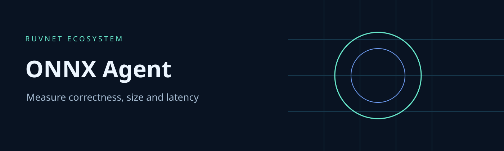

# ONNX Agent

ONNX Agent measures whether a model optimization preserves numerical output and actually improves deployment cost. Its v2 pipeline exports a deterministic linear model to ONNX, checks it, quantizes its weights to int8, executes both models through ONNX Runtime CPU and compares them against an independent NumPy reference.

This is a working qualification foundation, not a general model training service. The historical DSPy and PyTorch experiment code remains in `src/` and its tests in `tests/`; those components are excluded from the v2 wheel and supported test suite. They have not been certified against current APIs. Repeated inference is not test time training.

## Capabilities

| Capability | Behavior |
|---|---|
| Export | Seeded 64 by 32 linear graph, fixed batch 8, opset 13 and IR 10 |
| Optimization | Actual ONNX Runtime dynamic int8 quantization and graph optimization |
| Differential validation | 16 held out input batches against NumPy; fp32 error <=0.00001, int8 <=0.04 |
| Benchmark | 20 warmups, 1 to 1000 measured iterations, p50/p95 latency, bytes and SHA256 |
| Structural validation | Bounded local ONNX files, operator allowlist, static shape limits, no external tensors or custom functions |
| CLI and MCP | Repository status, fixed fixture qualification, test and benchmark tools, policy resource |
| MetaHarness and Autogenous | Generated host integrations and evidence gates; automatic promotion disabled |

## Install

Python 3.12 or later and Node 24 are required.

```sh
python -m venv .venv
. .venv/bin/activate
pip install -r requirements.txt
npm ci
npm test
```

## Usage

```sh
python -m onnx_agent qualify --iterations 1000
python -m onnx_agent validate --model reviewed-local-model.onnx
node mcp/cli.mjs status
node mcp/cli.mjs benchmark
node mcp/cli.mjs mcp
```

Local file validation only checks structure. It does not execute the supplied file or certify it against native runtime vulnerabilities. The inference API accepts only the built in fixture; no MCP tool accepts model paths, URLs, custom code, provider settings or credentials. CPU is the only qualified provider and fallback is disabled. CUDA, TensorRT, training, real model accuracy and hardware qualification remain separate work.

MCP tools: `project_status`, `model_qualify`, `project_benchmark`, `project_test`. Resource: `ruv://onnx-agent/policy`. Test execution requires operator setting `RUV_ALLOW_VALIDATION=1`; `ONNX_PYTHON` can select an operator controlled interpreter. Processes have a 30 second deadline, 128 KiB output ceiling, scrubbed environment and concurrency one.

## Measured result

One local run with 1000 iterations reduced serialized size from 8464 to 2876 bytes, about 66%. Int8 p95 was 0.00530 ms versus float32 0.00493 ms, approximately 8% slower on this tiny fixture. Maximum int8 absolute error was 0.01849. Quantization is not automatically faster; measure your workload. These numbers are fixture results, not state of the art or production model claims.

See [validation](docs/validation.md), [architecture decision](docs/adr/0001-qualification.md), [security](SECURITY.md) and [MetaHarness guide](.harness/README.md). CI tests supported Python versions, audits dependencies, builds the wheel and uploads validation evidence and distribution artifacts. No model is promoted or deployed automatically.

## Related projects

[RuFlo](https://github.com/ruvnet/ruflo) coordinates qualification tasks. [MetaHarness](https://github.com/ruvnet/metaharness) provides experiment tooling. [Autogenous](https://github.com/ruvnet/autogenous) supplies governed selection. [RuView](https://github.com/ruvnet/ruview) and [RuVector](https://github.com/ruvnet/ruvector) are future consumers of independently qualified models. [Reflective Engineer](https://github.com/ruvnet/reflective-engineer) reviews experiment metrics. Federation messages are data and do not authorize model execution.
